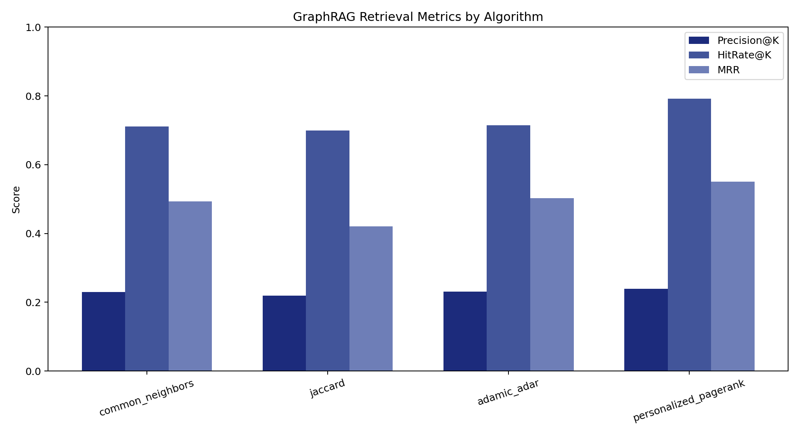
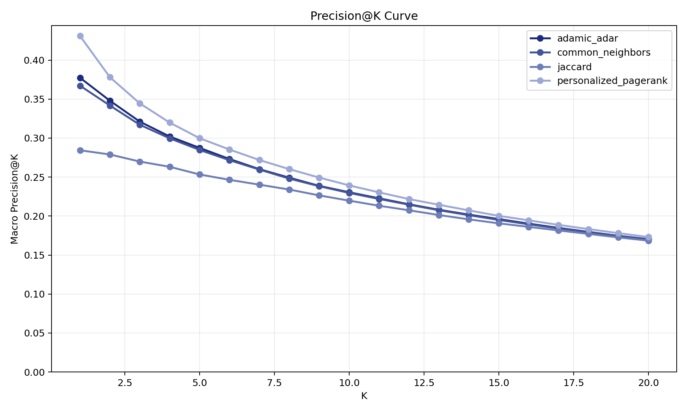
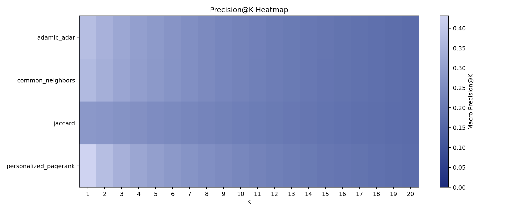
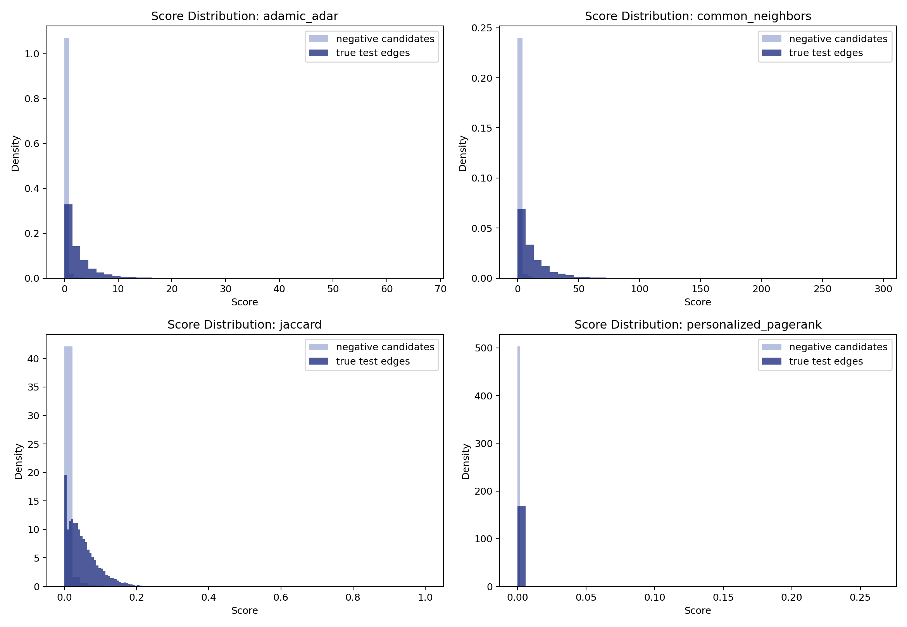
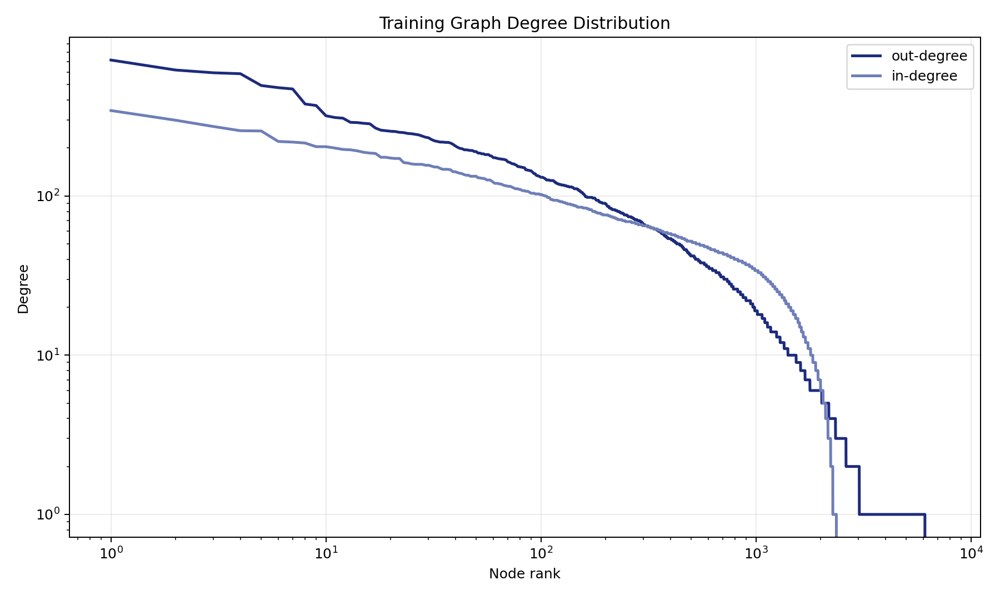
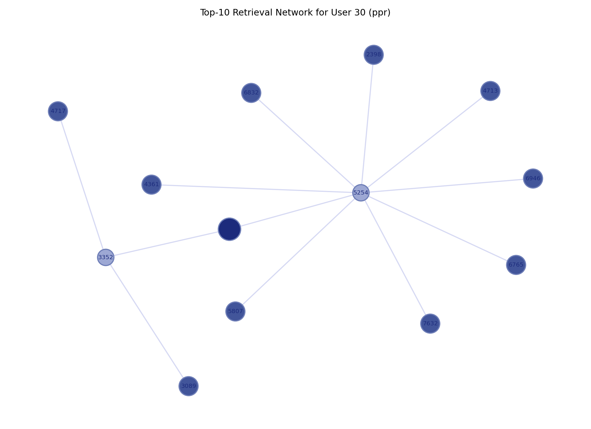
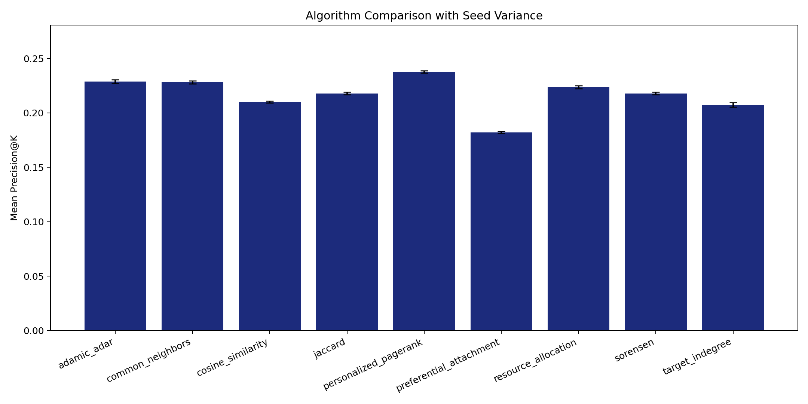
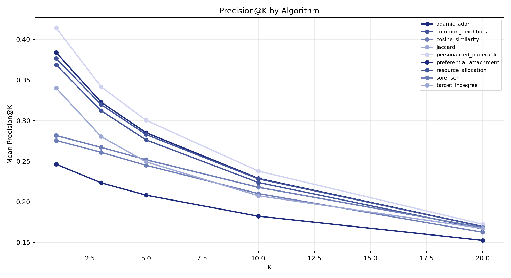
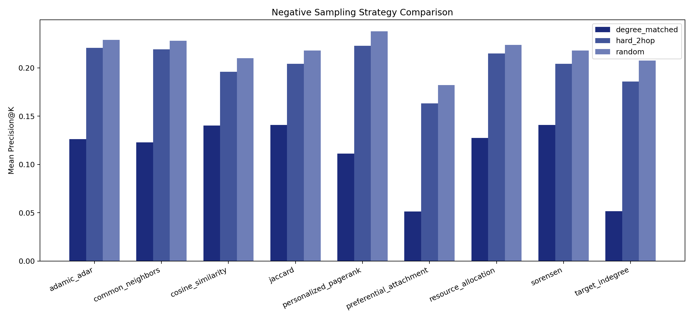
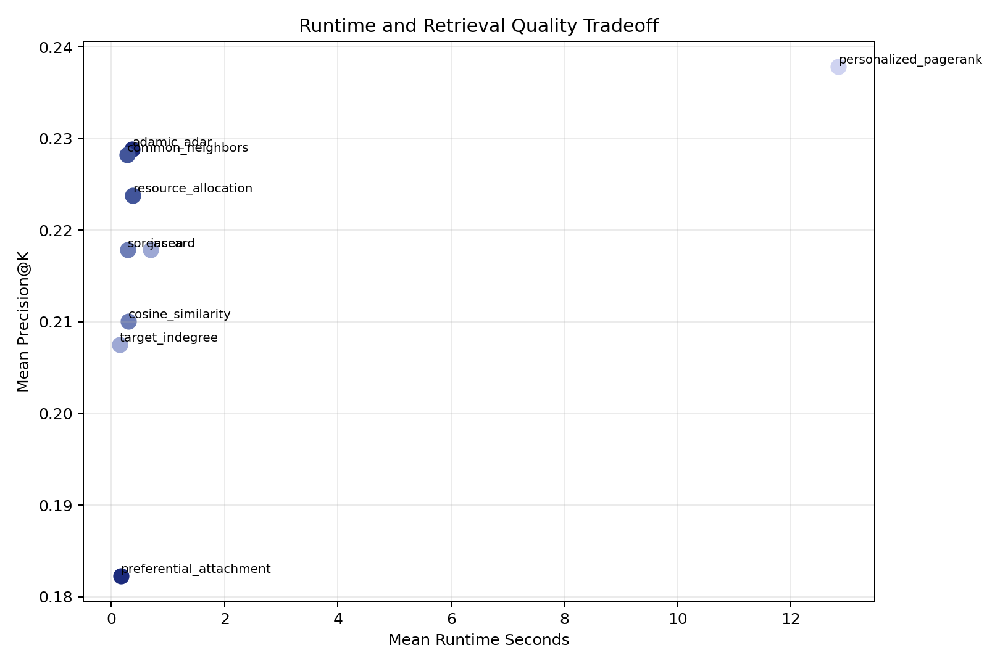

# Net RAG：基于 Wiki-Vote 的 GraphRAG 上下文检索

[English](README.md) | 简体中文


本仓库是 **Selected Topic 2: GraphRAG and Context Retrieval** 的学生作业实现。项目目标是实现一个简化版 GraphRAG 检索模块，并把 Wikipedia Vote Network 上的链路预测问题转化为上下文检索问题。

核心思想很直接：在图结构中，有用的上下文不一定能通过关键词直接匹配到。如果系统预测用户 `A` 和用户 `B` 之间存在较强关联，那么用户 `B` 就可以被视为用户 `A` 的相关图上下文。本项目用图算法实现这一思路，并对检索效果进行评估和可视化。

## 项目概览

| 项目 | 说明 |
| --- | --- |
| 作业主题 | GraphRAG and Context Retrieval |
| 数据集 | Wikipedia Vote Network，本地文件为 `Wiki-Vote.txt` |
| 任务建模 | 把链路预测作为上下文检索 |
| 训练/测试划分 | 按源节点分层随机划分，约 80/20 |
| 算法 | Common Neighbors、Jaccard、Adamic/Adar、Personalized PageRank |
| 主指标 | Macro Precision@10 |
| 横向评估 | 多 seed、多 K、多负采样策略的算法对比 |
| 额外输出 | 排名 CSV、检索示例、实验汇总和可视化图表 |

## 作业背景

大语言模型在缺少可靠上下文时容易产生幻觉。标准 RAG 会先检索相关文档，再把检索结果提供给模型，从而减少幻觉问题。但是，只依赖关键词相似度的检索方法可能会漏掉间接关系。

GraphRAG 把图结构加入检索过程。它不仅判断两个对象的文本是否相似，也会判断它们是否通过图中的关系相连。在本作业中，图数据来自 Wikipedia Vote Network，检索任务被建模为预测缺失链接。

## 数据集

本项目使用 SNAP Wikipedia Vote Network：

- **节点**：Wikipedia 用户或编辑者。
- **有向边**：从用户 `i` 到用户 `j` 的边表示用户 `i` 投票支持用户 `j` 成为 Wikipedia 管理员。
- **本项目使用的本地文件**：`Wiki-Vote.txt`。

原始文件中包含注释行和以制表符分隔的边数据。实现代码会直接解析原始文件，跳过注释行，去除重复边，并构建有向图。

## 数据处理

由于数据集没有提供时间戳，本项目使用可复现的随机划分，而不是时间划分。

划分策略按源节点分层进行：

- 对于至少有 2 条出边的源节点，大约 20% 的出边会被隐藏为测试边。
- 每个可划分的源节点至少保留 1 条训练边，使其在训练图中仍然有图上下文。
- 只有 1 条出边的节点默认保留在训练图中。

划分结果保存到：

- `outputs/splits/train_edges.csv`
- `outputs/splits/test_edges.csv`
- `outputs/splits/split_meta.json`

使用当前默认设置时，划分结果为：

| 划分 | 边数量 |
| --- | ---: |
| 训练边 | 82,822 |
| 测试边 | 20,867 |
| 原始唯一边总数 | 103,689 |

## 检索算法

项目比较 4 种图打分算法：

| 算法 | 在本项目中的作用 |
| --- | --- |
| `common_neighbors` | 根据两个节点共享邻居的数量打分。 |
| `jaccard` | 用共享邻居数量除以邻居并集大小，得到归一化相似度。 |
| `adamic_adar` | 对稀有共享邻居赋予更高权重。 |
| `personalized_pagerank` | 通过以源节点为中心的随机游走估计图相关性。 |

前三种局部相似度算法在训练图的无向投影上计算，这样可以减少稀疏有向图中大量候选对得分为零的问题。`personalized_pagerank` 在有向训练图上使用近似随机游走实现，保证完整数据集上的评估可以在合理时间内完成。

横向评估中还加入了 5 个对照算法：

| 算法 | 在横向评估中的作用 |
| --- | --- |
| `resource_allocation` | 按共享邻居的度倒数分配权重。 |
| `preferential_attachment` | 用源节点和目标节点的度乘积进行打分。 |
| `cosine_similarity` | 用类似余弦相似度的方式归一化共享邻居数量。 |
| `sorensen` | 使用 Sorensen-Dice 形式计算邻域重叠。 |
| `target_indegree` | 只按目标节点入度排序的热门节点基线。 |

## 评估设计

评估方式遵循标准链路预测流程：

1. 使用可见的 80% 边构建训练图。
2. 把隐藏的 20% 边作为真实缺失链接。
3. 对测试集中的每个源节点，把真实隐藏目标节点和随机采样的不存在目标节点放在一起排序。
4. 使用每种算法为候选目标节点打分。
5. 把 Top-K 预测结果与隐藏测试边进行比较。

主指标是宏平均 **Precision@10**。项目同时报告：

- `HitRate@10`
- `MRR`

使用 `Wiki-Vote.txt`、`seed=42`、`K=10`，并为每个源节点采样 `100` 个负样本时，当前完整数据集结果为：

| 算法 | Precision@10 | HitRate@10 | MRR |
| --- | ---: | ---: | ---: |
| `common_neighbors` | 0.229641 | 0.711373 | 0.493400 |
| `jaccard` | 0.219742 | 0.698766 | 0.420111 |
| `adamic_adar` | 0.230472 | 0.714056 | 0.502139 |
| `personalized_pagerank` | 0.239297 | 0.791845 | 0.551049 |

在这次运行中，`personalized_pagerank` 的整体检索效果最好。

## 横向评估

横向评估代码位于 `experiments/horizontal_eval/`。它和基础 CLI 评估分开，是因为这里要测试算法排序在不同随机种子、不同推荐深度和不同负样本难度下是否稳定。

流程如下：

1. `run.py` 读取实验配置，包括 seeds、K 值、负采样策略、算法列表和输出目录。
2. 对每个 seed，使用主流程相同的按源节点分层划分逻辑重新切分原始图。
3. `sampling.py` 用三种负采样策略构造候选集：
   - `random`：随机不存在边目标节点。
   - `degree_matched`：入度接近真实隐藏目标节点的不存在边目标节点。
   - `hard_2hop`：图中距离源节点较近的不存在边目标节点，作为更难区分的干扰项。
4. `extra_scorers.py` 把 4 个主算法和额外基线算法组合起来。
5. 每种算法在同一批候选集上排序，`aggregate.py` 输出单次运行指标和均值/标准差汇总。
6. `plot.py` 将汇总 CSV 转换为横向对比图。

默认横向评估输出保存在：

- `outputs/experiments/horizontal/runs.csv`
- `outputs/experiments/horizontal/summary_by_run.csv`
- `outputs/experiments/horizontal/summary_mean_std.csv`
- `outputs/experiments/horizontal/figures/*.png`

使用当前保存的完整横向评估结果，在 `5` 个 seed、`K=10`、每个源节点 `100` 个负样本、`random` 负采样策略下，汇总结果如下：

| 算法 | Mean Precision@10 | Std | Mean HitRate@10 | Mean MRR | Mean Runtime (s) |
| --- | ---: | ---: | ---: | ---: | ---: |
| `personalized_pagerank` | 0.237843 | 0.001007 | 0.787071 | 0.541522 | 12.839028 |
| `adamic_adar` | 0.228857 | 0.001787 | 0.712393 | 0.504670 | 0.372215 |
| `common_neighbors` | 0.228214 | 0.001387 | 0.710193 | 0.498266 | 0.275621 |
| `resource_allocation` | 0.223804 | 0.001420 | 0.711642 | 0.494236 | 0.376790 |
| `jaccard` | 0.217886 | 0.001161 | 0.693455 | 0.415849 | 0.690525 |
| `sorensen` | 0.217886 | 0.001161 | 0.693455 | 0.415849 | 0.292503 |
| `cosine_similarity` | 0.210075 | 0.000995 | 0.698498 | 0.414023 | 0.306097 |
| `target_indegree` | 0.207479 | 0.002073 | 0.793348 | 0.485981 | 0.144182 |
| `preferential_attachment` | 0.182269 | 0.000830 | 0.731116 | 0.401870 | 0.166404 |

主要结论是：`personalized_pagerank` 仍然取得最高的平均 Precision@10 和 MRR，但运行时间明显更长。`adamic_adar`、`common_neighbors` 和 `resource_allocation` 构成了一组更快的局部邻域方法，Precision@10 非常接近。

## 可视化展示

下面的图片由当前实验输出生成。图片副本保存在 `docs/figures/` 中，因此可以直接在 README 里展示。

| 指标总览 | Precision@K 曲线 |
| --- | --- |
|  |  |

| Precision 热力图 | 正负样本分数分布 |
| --- | --- |
|  |  |

| 训练图度分布 | 检索网络示例 |
| --- | --- |
|  |  |

### 横向评估图表

下面的图展示多 seed 横向评估结果。它们从 `outputs/experiments/horizontal/figures/` 复制到 `docs/figures/`，以便 README 稳定展示。

| 算法均值与方差 | 各算法 Precision@K |
| --- | --- |
|  |  |

| 负采样策略对比 | 运行时间与检索质量权衡 |
| --- | --- |
|  |  |

## 项目架构

```text
.
├── net_rag/                         # 支持 python -m net_rag.cli 的轻量桥接包
├── experiments/
│   └── horizontal_eval/              # 多 seed 横向评估流程
├── scripts/
│   └── visualize_results.py         # 生成结果可视化
├── src/net_rag/
│   ├── candidates.py                # 构建正样本和负样本候选集
│   ├── cli.py                       # 命令行入口
│   ├── constants.py                 # 默认参数
│   ├── data.py                      # 数据解析与产物读写
│   ├── evaluation.py                # 指标计算和内置算法对比图
│   ├── retrieval.py                 # 单用户上下文检索和解释
│   ├── scorers.py                   # 图打分算法
│   └── split.py                     # 分层随机训练/测试划分
├── tests/                           # 单元测试和端到端烟雾测试
├── GraphRAG_Context_Retrieval_Topic2.md
├── Wiki-Vote.txt
├── requirements.txt
└── sitecustomize.py
```

代码被组织成 `src/net_rag/` 下的轻量 Python 包。`cli.py` 负责把完整流程串起来，包括数据准备、算法评估和单用户检索。

## 项目如何运作

整个流程分为 4 个主要阶段：

1. **Prepare**：解析 `Wiki-Vote.txt`，把边划分为训练集和测试集，并保存划分产物。
2. **Evaluate**：为每个测试源节点构造候选目标节点，用不同图算法打分、排序，并计算评估指标。
3. **Retrieve**：对指定用户推荐 Top-K 相关用户，推荐对象不会包含训练图中已经存在的可见出边。
4. **Horizontal Evaluate**：在多个 seed、多个 K、不同负采样策略和额外基线算法上重复对比。
5. **Visualize**：生成多角度图表，用于分析算法效果、数据划分、分数分布、图度分布、具体检索网络示例和横向实验权衡。

这个结构对应作业目标：项目不是完整的 LLM 应用，而是一个可以运行、可以评估、可以解释结果的 GraphRAG 检索模块。

## 环境配置

创建本地虚拟环境并安装依赖：

```powershell
python -m venv .venv
.\.venv\Scripts\python -m pip install --upgrade pip
.\.venv\Scripts\python -m pip install -r requirements.txt
```

仓库包含轻量桥接包，因此可以在仓库根目录直接运行命令：

```powershell
.\.venv\Scripts\python -m net_rag.cli --help
```

## 运行项目

准备训练/测试划分：

```powershell
.\.venv\Scripts\python -m net_rag.cli prepare --input Wiki-Vote.txt --seed 42
```

评估全部算法：

```powershell
.\.venv\Scripts\python -m net_rag.cli evaluate --k 10
```

为单个用户检索上下文：

```powershell
.\.venv\Scripts\python -m net_rag.cli retrieve --user-id 30 --algo ppr --k 10
```

生成可视化：

```powershell
.\.venv\Scripts\python scripts\visualize_results.py --output-dir outputs --max-k 20 --user-id 30 --algo ppr
```

运行完整横向评估：

```powershell
.\.venv\Scripts\python -m experiments.horizontal_eval.run --input Wiki-Vote.txt --output-dir outputs\experiments\horizontal --seeds 7,13,21,42,100 --k-values 1,3,5,10,20 --negative-strategies random,degree_matched,hard_2hop --negatives-per-source 100
```

运行快速横向评估烟雾测试：

```powershell
.\.venv\Scripts\python -m experiments.horizontal_eval.run --output-dir outputs\experiments\horizontal_smoke --seeds 42 --k-values 1,3 --negative-strategies random --algorithms common_neighbors,target_indegree --max-sources 20
```

运行测试：

```powershell
.\.venv\Scripts\python -m pytest
```

## 输出结果

主要生成文件：

- `outputs/metrics/summary.csv`：所有算法的评估指标。
- `outputs/rankings/*.csv`：每种算法的候选边排序结果。
- `outputs/retrievals/user_30_ppr.csv`：单用户 Top-K 上下文检索示例。
- `outputs/figures/*.png`：可视化分析结果。
- `outputs/experiments/horizontal/*.csv`：横向评估运行日志和聚合指标。
- `outputs/experiments/horizontal/figures/*.png`：横向评估可视化结果。

可视化文件包括：

- `algorithm_compare.png`
- `metrics_summary.png`
- `train_test_split.png`
- `precision_at_k_curve.png`
- `hit_rate_at_k_curve.png`
- `precision_at_k_heatmap.png`
- `first_hit_rank_cdf.png`
- `score_distribution_positive_negative.png`
- `test_positives_per_source_distribution.png`
- `train_degree_distribution.png`
- `user_30_ppr_retrieval_network.png`

横向评估可视化文件包括：

- `algorithm_mean_std.png`
- `precision_at_k_by_algorithm.png`
- `negative_strategy_compare.png`
- `runtime_quality_tradeoff.png`

所有可视化使用指定配色：

```text
#1c2b7c
#42559a
#6e7eb7
#9da8d4
#cfd3f1
```

## 如何理解结果

- 指标表可以看出哪种图算法更准确地找回隐藏链接。
- Precision@K 和 HitRate@K 曲线展示推荐数量增加时性能如何变化。
- 分数分布图可以观察算法是否能把真实隐藏边和随机负样本区分开。
- 度分布图展示训练图的长尾结构，这是真实网络中常见的现象。
- 检索网络图给出一个小例子，展示推荐结果可以如何通过图路径解释。
- 横向评估图可以观察算法排序在不同 seed、K 值和更难负样本下是否稳定。
- 运行时间与质量权衡图展示随机游走方法虽然更强，但比局部邻域基线更慢。

## 测试

测试套件覆盖：

- 原始文件解析
- 确定性的训练/测试划分
- 负样本候选采样
- 打分输出形状和数值有效性
- 小规模端到端 CLI 流程
- 横向评估 scorer、负采样策略、聚合逻辑和烟雾测试 CLI 输出

这些测试用于说明项目可以从原始数据重新运行，并且主要流程是可复现的。
